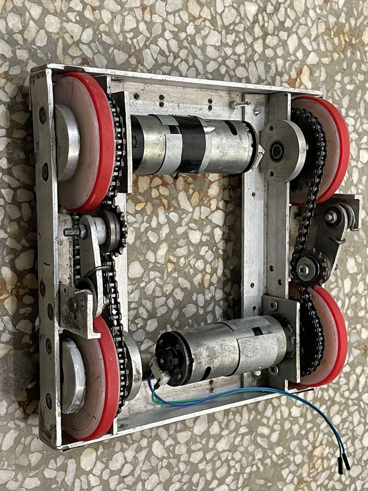

# NERC 2024 Indigenous Robot - Autonomous Plantation Robot

🏆 Our team successfully secured first place in the Mini-NERC 2024 competition, demonstrating excellent capabilities in Robotics & Mechatronics doman.

  
   
  <em>Winning team at Mini-NERC 2024</em>

  
   
  <em>Winner Certificate</em>

---

##  Project Overview

### National Engineering Robotics Contest (NERC) 2024

The National Engineering Robotics Contest represents a collaborative initiative between the National University of Sciences and Technology (NUST) and the Higher Education Commission's STEM Careers Programme. NERC serves as Pakistan's premier platform for advancing robotics research and fostering innovation in autonomous systems.

### ❓ Problem Statement

The 2024 theme challenged teams to develop an autonomous robot capable of executing a complete tree plantation workflow:

**Primary Objectives:**
- Autonomous navigation through a structured farm environment
- Detection and removal of obstacles (rocks) from designated plantation areas
- Precise placement of trees in prepared soil locations
- Task completion within strict time and accuracy constraints

**Technical Requirements:**
- Fully autonomous operation with no human intervention
- Indigenous design and fabrication of all electronic systems
- Compliance with dimensional and weight specifications
- Integration of multiple sensor systems for navigation and object detection

### 🧱 Arena Specifications

The competition arena simulates a realistic agricultural environment:

- **Grid System**: 12×12 inch precision grid layout
- **Plantation Field**: Dedicated 3×3 grid area for tree placement
- **Dynamic Layout**: Randomized Rock & Tree placement across 9 possible positions
- **Navigation Aids**: Black line pathways and wall-mounted 2D position map

  
   
  <em>Competition arena layout</em>

### 📐 Physical Constraints

| Parameter | Value |
|-----------|-------|
| **Dimensions** | 10" × 10" × Variable Height | 
| **Weight** | < 12 kg | 

📌 For complete information about the competition theme, check [this](/NERC-2024%20Draft1.0.pdf).

---

## 🤖 Robot Overview

### Hardware Design

**Core System Components:**

| Component | Specification | Notes |
|-----------|--------------|-----------|
| **Microcontroller** | Arduino Mega (ATmega2560) | Increased I/O capability, more memory, suitable for complex robotics applications |
| **Sensor Array** | TCRT5000 IR Array (5-channel) | For Line Following |
| **Wheel Motor** | 24V DC Encoder Motors | Differential Drive Configuration |
| **Power System** | 25V LiPo Battery Pack | Alongwith Buck Convertor for Voltage Regulation |
| **Motor Control Circuit** | Custom H-Bridge Design | Indigenous category requirement |
| **Servo Motor** | MG996R Metal Gear Servo Motor | For lifting mechanism |

### Motor Control Circuit Design

The competition required designing a robust H-Bridge motor controller from discrete components.

**Design Specifications:**
- Bidirectional motor control with instant direction reversal
- PWM-based speed regulation
- 3A current capacity
- Arduino-compatible control interface

**Development Process:**
1. **Circuit Analysis**: Theoretical design validation using circuit simulation
2. **Prototype Testing**: Breadboard implementation and performance verification
3. **PCB Design**: Professional circuit board layout using Proteus software
4. **Manufacturing**: Self PCB fabrication and assembly

  
   
  <em>Circuit Testing</em>

### ⚙️ Mechanical System 

Structure of Robot Chassis 

<table align="center">
  <tr>
    <td align="center">
       
    </td>
    <td align="center">
       
    </td>
  </tr>
</table>

### 🔋 Power Management System

**Custom Battery Configuration:**
- **Cell Type**: 3.7V Lithium Polymer
- **Configuration**: 7-cell series arrangement (7S1P)
- **Capacity**: 4000mAh
- **Output Voltage**: 25.9V (nominal)

---

## 💻 Coding Development

### Development Process

1. **Hardware Setup**: Pin configuration and sensor/motor interface initialization
2. **Basic Motion Control**: Implementation of fundamental movement functions with encoder feedback
3. **Navigation System**: Development of line-following and turning algorithms using sensor arrays
4. **Task Automation**: Integration of object manipulation functions (pick/drop operations)
5. **System Testing**

### ⚡Function Overview

**Movement Control:**
- `goStraightAlign()`, `goback()`, `stop()` - Basic motion with differential speed control
- `rotateLeft()`, `rotateRight()`, `rotate180()` - Precision turns using encoder feedback
- `turnSlightlyLeft()`, `turnSlightlyRight()` - Line-following trajectory corrections

**Task Functions:**
- `pick()`, `drop()` – Automated manipulation with servo control  
- `map_reading()` – 2D map reading  

 

https://github.com/user-attachments/assets/2c020f59-3387-43c8-be6c-983f413f9202

